# AI 工作流程指南

> 本文档定义了 AI 助手在项目中工作的标准流程和最佳实践。

## 🚨 核心原则

**每完成一个功能单元，必须同步完成以下全部交付物：**

| 交付物 | 必须 | 说明 |
|--------|------|------|
| 功能代码 | ✅ | 组件/API/功能实现 |
| 类型定义 | ✅ | Props、接口、导出 |
| Stories/示例 | ✅ | Storybook 展示 |
| 文档 | ✅ | apps/ui-doc 中的 mdx |
| 测试 | ⚡ | 基础测试（复杂逻辑必须） |
| PROGRESS.md | ✅ | 更新进度记录 |

**不完整的功能 = 未完成**

---

## 组件开发完整流程

### 📋 Checklist（每个组件必须全部完成）

```
□ 1. 组件实现
  □ packages/ui/src/components/{Name}/{Name}.tsx
  □ packages/ui/src/components/{Name}/index.ts
  □ packages/ui/src/index.ts 添加导出

□ 2. Stories 示例
  □ packages/ui/src/components/{Name}/{Name}.stories.tsx
  □ 包含：默认、所有变体、所有尺寸、禁用状态、交互示例

□ 3. 文档页面
  □ apps/ui-doc/src/content/docs/components/{name}.mdx
  □ 包含：描述、安装、基础用法、Props 表格、所有变体示例

□ 4. 验证通过
  □ pnpm lint
  □ pnpm typecheck
  □ Storybook 可视化检查

□ 5. 询问用户确认
  □ 展示完成的交付物
  □ 等待用户确认

□ 6. 更新进度（用户确认后）
  □ PROGRESS.md 勾选完成
  □ 添加会话日志条目
```

### 🔄 单组件开发流程图

```
开始
  │
  ├─1─► 创建组件文件
  │       └─► {Name}.tsx + index.ts + 导出
  │
  ├─2─► 实现组件逻辑
  │       └─► Props + tailwind-variants + JSX
  │
  ├─3─► 创建 Stories
  │       └─► {Name}.stories.tsx（全部变体）
  │
  ├─4─► 创建文档
  │       └─► apps/ui-doc/.../components/{name}.mdx
  │
  ├─5─► 验证
  │       └─► lint + typecheck + Storybook 检查
  │
  └─6─► 更新 PROGRESS.md
          └─► 勾选 + 会话日志
```

### 📝 Stories 模板

```typescript
// packages/ui/src/components/{Name}/{Name}.stories.tsx
import type { Meta, StoryObj } from 'storybook-solidjs-vite'
import { {Name} } from './{Name}'

const meta: Meta<typeof {Name}> = {
  title: 'Components/{Name}',
  component: {Name},
  tags: ['autodocs'],
}

export default meta
type Story = StoryObj<typeof {Name}>

// 必须包含的 Stories
export const Default: Story = { args: {} }
export const Variants: Story = { /* 所有变体 */ }
export const Sizes: Story = { /* 所有尺寸 */ }
export const Disabled: Story = { args: { disabled: true } }
```

### 📝 文档模板

```mdx
---
title: {Name}
description: {组件描述}
---

import { {Name} } from '@beeve/ui'

## 安装

组件包含在 `@beeve/ui` 包中。

## 基础用法

<{Name}>示例</{Name}>

## Props

| 属性 | 类型 | 默认值 | 说明 |
|------|------|--------|------|
| variant | 'default' \| 'outline' | 'default' | 变体 |
| size | 'sm' \| 'md' \| 'lg' | 'md' | 尺寸 |

## 变体

### Default
<{Name} variant="default">Default</{Name}>

### Outline
<{Name} variant="outline">Outline</{Name}>
```

---

## 任务管理体系

### 核心文件

| 文件 | 用途 | 更新频率 |
|------|------|---------|
| `PROGRESS.md` | 进度追踪、待办事项、会话日志 | **每完成一个功能** |
| `.ai/decisions/` | 架构决策记录 (ADR) | 重大决策时 |
| Git Commits | 代码变更历史 | 每次提交 |

### 任务层次

```
Phase (阶段)     → PROGRESS.md 中的大标题
  └─ Task (任务) → PROGRESS.md 中的 checkbox
       └─ Step  → AI 会话内 task list
```

### 会话工作流程

```mermaid
graph TD
    A[接收任务] --> B[阅读 PROGRESS.md]
    B --> C[理解当前阶段和上下文]
    C --> D[创建任务清单]
    D --> E[执行单个功能]
    E --> F[完成全部交付物]
    F --> G[验证: lint + typecheck]
    G --> H{通过?}
    H -->|否| E
    H -->|是| I[更新 PROGRESS.md]
    I --> J{还有任务?}
    J -->|是| E
    J -->|否| K[会话日志]
```



### 会话开始时

1. **阅读 `PROGRESS.md`** - 了解当前进度
2. **检查"下一步行动"** - 确认待做事项
3. **创建任务清单** - 使用 add_tasks 工具拆分任务
4. **查看"阻塞问题"** - 了解已知障碍

### 每完成一个功能单元时

1. **验证** - 运行 `pnpm lint && pnpm typecheck`
2. **询问用户确认** - 展示交付物，等待确认
3. **用户确认后** - 更新 PROGRESS.md，标记任务完成

### 会话结束时

1. **确认所有交付物完整** - 代码 + Stories + 文档
2. **添加会话日志** - 记录本次完成的工作
3. **更新"下一步行动"** - 指导下次会话
4. **记录阻塞问题** - 如有

### 架构决策记录 (ADR)

当做出重大技术决策时，在 `.ai/decisions/` 创建 ADR：

```markdown
# ADR-NNN: 决策标题

**状态**: proposed / accepted / deprecated
**日期**: YYYY-MM-DD

## 背景
为什么需要这个决策

## 决策
具体选择了什么

## 理由
为什么这样选择

## 后果
这个决策带来的影响
```

### Git 提交规范

使用 Conventional Commits 便于回溯：

```
<type>(<scope>): <subject>

类型:
- feat: 新功能
- fix: 修复
- docs: 文档
- style: 格式
- refactor: 重构
- test: 测试
- chore: 构建/工具

示例:
feat(ui): add Button component
fix(auth): resolve token refresh issue
docs(api): update authentication guide
```

### 回溯与恢复

**查找变更原因**:
```bash
git log --oneline --grep="关键词"
git log --oneline packages/ui/
```

**查看决策背景**:
```bash
cat .ai/decisions/001-solidjs.md
```

**恢复到之前状态**:
```bash
git revert <commit>
git checkout <commit> -- <file>
```

---

## 工作前准备

### 1. 理解任务

在开始任何任务之前，AI 应该：

- [ ] 明确任务目标和范围
- [ ] 确认涉及的包/模块
- [ ] 检查是否有相关的现有代码可参考
- [ ] 确认是否需要新增依赖

### 2. 阅读相关文档

根据任务类型，阅读对应文档：

| 任务类型 | 相关文档 |
|---------|---------|
| 组件开发 | [components.md](./components.md) |
| API 开发 | [api.md](./api.md) |
| 数据库变更 | [database.md](./database.md) |
| 低代码相关 | [lowcode.md](./lowcode.md) |
| 通用开发 | [conventions.md](./conventions.md) |

### 3. 检查现有代码

```bash
# 查找相似实现
grep -r "相关关键词" packages/

# 查看目录结构
tree packages/ui/src/components/
```

## 任务执行流程

### 组件开发流程

参见上方「组件开发完整流程」章节的详细 Checklist。

**关键提醒：**
- 每个组件必须同时完成：代码 + Stories + 文档 + 导出 + PROGRESS.md
- 不完整的组件视为未完成

### API 开发流程

```
1. 规划 API
   - 确定路由路径
   - 确定请求/响应格式
   - 确定错误码

2. 定义验证 Schema
   - 在 @beeve/shared/validators 中定义 Zod schema
   - 或在路由文件中定义

3. 实现路由
   - 创建路由文件
   - 添加验证中间件
   - 实现业务逻辑

4. 注册路由
   - 在 routes/index.ts 中注册

5. 验证
   - 运行 pnpm lint
   - 运行 pnpm typecheck
   - 使用工具测试 API
```

### 数据库变更流程

```
1. 修改 Schema
   - 在 packages/db/src/schema/ 中修改
   - 更新关联定义

2. 生成迁移
   - pnpm db:generate

3. 检查迁移文件
   - 确认 SQL 正确

4. 执行迁移
   - pnpm db:migrate

5. 更新种子数据（如需要）
   - 修改 seed/ 文件

6. 验证
   - pnpm db:studio 检查数据结构
```

## 代码质量检查清单

### 提交前检查

- [ ] `pnpm lint` 无错误
- [ ] `pnpm typecheck` 无错误
- [ ] 代码已格式化（`pnpm format`）
- [ ] 新代码有适当的类型注解
- [ ] 复杂逻辑有注释说明
- [ ] 导出已添加到 index.ts

### 组件检查

- [ ] Props 有完整的 TypeScript 类型
- [ ] 支持 `class` 属性覆盖样式
- [ ] 使用 `splitProps` 分离 props
- [ ] 有基础的可访问性支持
- [ ] 有 Storybook 文档

### API 检查

- [ ] 有请求验证（Zod）
- [ ] 错误有正确的状态码和消息
- [ ] 敏感数据不在响应中泄露
- [ ] 需要认证的路由有 authMiddleware

## 常见问题处理

### 类型错误

```typescript
// 问题：推断类型不正确
// 解决：使用显式类型注解

// ❌
const data = await fetch('/api/users')
  .then(r => r.json())

// ✅
const data = await fetch('/api/users')
  .then(r => r.json()) as User[]
```

### 循环依赖

```typescript
// 问题：A imports B, B imports A
// 解决：提取共享代码到第三个文件

// shared/types.ts
export type SharedType = { ... }

// a.ts
import { SharedType } from './shared/types'

// b.ts
import { SharedType } from './shared/types'
```

### Solid 响应式丢失

```typescript
// 问题：解构 props 导致响应式丢失
// 解决：直接使用 props.xxx 或使用 splitProps

// ❌
const Component = (props) => {
  const { value } = props // 响应式丢失
  return <div>{value}</div>
}

// ✅
const Component = (props) => {
  return <div>{props.value}</div>
}

// ✅ 或使用 splitProps
const Component = (props) => {
  const [local, rest] = splitProps(props, ['value'])
  return <div>{local.value}</div>
}
```

## 命名速查

### 文件命名

| 类型 | 格式 | 示例 |
|------|------|------|
| 组件 | PascalCase | `Button.tsx` |
| Hook | kebab-case + use- | `use-auth.ts` |
| 工具函数 | kebab-case | `format-date.ts` |
| 类型文件 | kebab-case | `user-types.ts` |
| 常量 | kebab-case | `error-codes.ts` |
| 测试文件 | *.test.ts | `Button.test.tsx` |
| Stories | *.stories.tsx | `Button.stories.tsx` |

### 变量/函数命名

| 类型 | 格式 | 示例 |
|------|------|------|
| 变量 | camelCase | `userName` |
| 常量 | UPPER_SNAKE_CASE | `MAX_RETRY_COUNT` |
| 函数 | camelCase | `getUserById` |
| 组件 | PascalCase | `UserProfile` |
| 类型/接口 | PascalCase | `UserProfile` |
| 枚举 | PascalCase | `UserRole` |
| 枚举值 | PascalCase 或 UPPER_SNAKE_CASE | `Admin` 或 `ADMIN` |

### API 路由命名

```
GET    /api/users           # 获取列表
GET    /api/users/:id       # 获取详情
POST   /api/users           # 创建
PATCH  /api/users/:id       # 更新
DELETE /api/users/:id       # 删除

# 嵌套资源
GET    /api/projects/:id/pages
POST   /api/projects/:id/pages

# 操作类（非 RESTful）
POST   /api/auth/login
POST   /api/auth/logout
POST   /api/auth/refresh
```

## 快捷命令

```bash
# 开发
pnpm dev                        # 启动所有服务
pnpm dev --filter=@beeve/web    # 只启动 web
pnpm dev --filter=@beeve/server # 只启动 server

# 代码质量
pnpm lint                       # 检查
pnpm lint:fix                   # 修复
pnpm format                     # 格式化
pnpm typecheck                  # 类型检查

# 数据库
pnpm db:generate                # 生成迁移
pnpm db:migrate                 # 执行迁移
pnpm db:studio                  # 打开 Studio

# Storybook
pnpm storybook                  # 启动 Storybook

# 构建
pnpm build                      # 构建所有
pnpm build --filter=@beeve/ui   # 只构建 ui
```

## 上下文传递

当处理复杂任务时，AI 应该：

1. **保持任务上下文**：记住当前正在做什么
2. **明确中间结果**：告知用户已完成的步骤
3. **请求确认**：在重大变更前请求用户确认
4. **错误恢复**：遇到错误时，提供清晰的错误信息和恢复建议

## 任务边界

### AI 应该做的

- ✅ 编写符合项目规范的代码
- ✅ 创建必要的类型定义
- ✅ 添加适当的注释
- ✅ 更新相关的导出文件
- ✅ 提供代码变更的解释

### AI 不应该做的

- ❌ 修改不相关的文件
- ❌ 引入不必要的依赖
- ❌ 创建与现有代码风格不一致的代码
- ❌ 跳过类型定义
- ❌ 忽略错误处理
